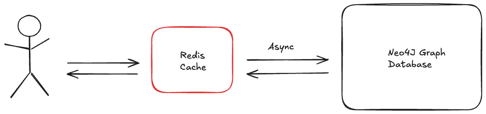

# System Design Outlook


## Initial Thoughts from intuition
I think its important to firstly consider the system flow. The exercise is a smaller scope of a whole news feed system (sign up, posting, folliwing, viewing); i.e this is the viewing subsystem. It is essentially a sub-system to allow users to view media on their feeds after it has ALREADY been posted by signed up users.
Given this large system I think its good to understand the scope of the smaller system. We coould just use an inmemory db and that should be good enough. However, we recognise the context of how posts will actually be stored in the larger system and this will be some form of database. Thus I'll use a database as a source of truth.


## Key Requirements
- Implement the provided API endpoints
- Design and implement an efficient database schema
- Persist data in a suitable data store (e.g., PostgreSQL, DynamoDB, Redis)
- Support pagination with cursor-based navigation
- Ensure no duplicate content is shown to users if it is marked as seen
- Implement caching for improved performance where possible
- Achieve sub-100ms response times for local requests per page


## Database 
Let's start of with the base layer which is our database. As stated before an inMemory database is fast and will suffice but taking into acccount the larger system and strenghtened durabilty, its better to have some stronger database to store users, comments, posts etc etc. Looking at this data currently we have:

An object can be:
- User
- Media
- Feed Post
- Comment
- Other data the `ts` file expects

Each user feed, looks like it has a one-to-one relationship with a certain media. This feed is then made available to everyone. I would assume some other logic is going on to even have this comment appear in the first place. I.e it might be something along the lines of: "Users can have friends and they can share media with friends. Once shared this can become a feedpost. It looks like each user has friends. Friends can see this media. When they comment on it it becomes a news feed" Each media can have multiple people sharing it.

```
grep -c "media_shared_by" api/data/edges.csv | cat
47196
grep -c "friend" api/data/edges.csv | cat
4278
grep -c "comment" api/data/objects.csv | cat
26853
grep -c "media" api/data/objects.csv | cat
148009
grep -c "feed_post" api/data/objects.csv | cat
18565
grep -c "user" api/data/objects.csv | cat
1773
```


Generally for such strong relational data such as this, this points us in two directions: graph database or relational database. In this case it just makes sense to use a graph db. The data itself is quite abstract, for example we do not know who made the comment just the comment exits. For example a user shares a post, they might be sharing it with one person or many, if just one we need the other user, if many, then many to many relationships are better suited for graph like databases.

We can add a constrain to make sure that there exits some comment on a media for the feedpost to exist. 

Feed content is predictable, and should be ranked by one or more factors: In order to rank the feed content we could do it by how many shares that media has. If a user has shared one media, we can rank that user on how many total other shares they have. If they have more then they should be ranked higher? Trade off is user experience compared to speed of query. (Post exercise comment: I dont actually end up ranking this way as I ran out of time, so I kept it as timestamp for simplicity)

Given our choice of a graph database, we opt for Neo4j due to it's popularity. The schema is given in `api/db/schema.cypher`.

## API protocol selection and rationale

For our API, we have chosen to opt for a RESTful API due to endpoints being so simple. However when we want to scale, a GraphQL may be the better choice here. Especially for data retrieval. Since we have a graph like database, naturally GraphQL allows more complex queries. GRPC and RPC are not considered and seem overly complex for this task.

## Caching strategies
There are multiple caching strategies. In general it is good to have a news feed ready to go immediately for each user. As such our application never entirely should read from the database (read-through), only from our cache. The `news_post` objects are the only items stored in cache, to minimise costs. For writes, there is some consideration for either write-through or write-back. We optied for write back to minimise latency and to trade-off some eventual consistency. (Maybe this will change with further testing)


### <u>Redis vs Memcached</u>

We could use memecached here, however Redis' sorted sets is perfetly suited for this task. The set can rank items by a score (number of connetions on one user possibly) and serve to the user that way. Any ranking works here, the ranking algorithm is out of scope. The write is also fast as the data structure is ultimately a set.





## Performance optimization approaches
The main bottleneck in our system arrives from the job to warm the cache up. Thus there are a couple optimisations to think about. 
1. Database Indexing Strategy

We'll create composite indexes on timestamp + user ID combinations and range indexes for time-based filtering to accelerate feed generation queries.

2. Database Triggers for Real-time Updates

We'll implement database triggers using NOTIFY/LISTEN or change data capture to push updates immediately when new content is created.

3. Connection Pooling Optimization

We'll configure dedicated connection pools with higher limits specifically for cache warming operations, separate from user-facing queries.

4. Database Change Subscriptions

We'll set up real-time subscriptions to database change streams to process only incremental changes instead of full feed regeneration.

5. Geolocation service

As we scale we aim to distrubute the cash to server users on their ID and partition the redis clusters based on this and location.


## Scalability considerations

In general there is much to still consider after this excercise. Realistically Kafka should be used to queuing data correctly such that the cache and database don't get overloaded. A rate limiter should also be implemented to handle more requests. I can see someone easily taking this application down whether it be malicious or not.
Generally if we are scaling to many users with many different feeds we aim to have a "*per-user cache*". I.e each user will have their own seperate cache, each geolocated. Facebook have a brilliant paper on this topic.

We must also recognist the fanout problem. There are many ways to combat this. By loooking at popular users having their own store each other user must pull from if subscibed is a possible solution. 

While there are a numourous number of TODOs jotted throughout the code the main ones are listed below:


## TODOs:

- Implement a stronger more relational schema to fit the front end
- Rate limiting is a high priority and should be done ASAP
- Ranking algorithim is weak and could be improved
- Logging is also weak. Its fairly simply to implement log outputs to a file or Loki + Grafana will fit this perfectly
- The redis cache is not run automatically via a trigger or notificaiton service. This needs to be done for production such that real time data can get into the cache.
- Cache must be monitered correctly to not overload it. Fitting all the posts for a user inside cache may not be the best for now.
- Probably should provision the API directory in Docker
- Have a class surrounding the redis functions. This allows us to store data in actual memory as well. Which is even faster. Also would be usefull for code structure.
- Improve data loading speed, I believe batch transactions are faster (unsure how, need to investigate further)

## Performance metrics:

 The redis query is quite fast fetching is quite fast. In general we achieve:

- Avg Total time: ~ 15ms
- Avg Request time: ~ 5ms
- Avg Response time: ~ 10ms


